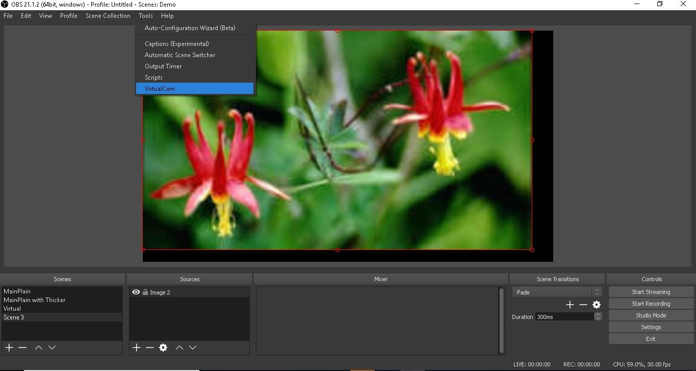
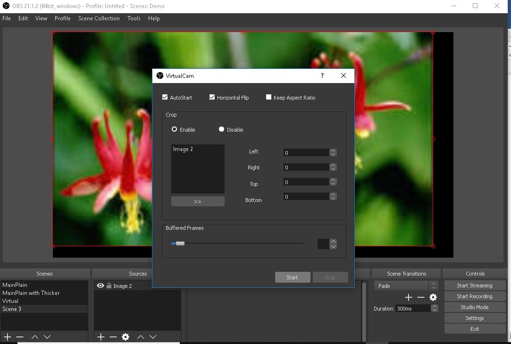

# Agora Game Show Template

The Agora Game Show template enables you to quickly get started with building a game show application. This tutorial will explain how to create an Agora account, download the HQ SDK, and use an Agora template branch to use as a framework for your [Agora API](https://docs.agora.io/en/) application.

- [General Overview](#general-overview)
- [Architecture Overview](#architecture-overview)
- [Hardware / Software Requirements](#hardware-software-requirements)
- [Customize the UI](#customize-the-ui)
- [How to Use the Template](#how-to-use-the-template)
- [Game Play Instructions](#game-play-instructions)
- [Give Feedback](#give-feedback)
- [Contribute to the Template](#contribute-to-the-template)
- [Resources](#resources)
- [License](#license)

## General Overview

Agora HQ trivia is a live-streamed quiz show. 

- [Agora HQ Trivia Game Flow](#agora-hq-trivia-game-flow)
- [Agora SDK Integrations](#agora-sdk-integrations)
- [Agora Game Demo](#agora-game-demo)

### Agora HQ Trivia Game Flow

Players can participate in daily trivia games and win prize money. The game consists of a round of 10-12 questions. Each question has three answer choices.

- The host asks a the series of questions, each with increased difficulty.

- Players who correctly answer the question within the 10-second limit continue through the game. Players who answer incorrectly are eliminated from the game.

- At the end of the game, players that answer all the questions questions correctly, split the prize money.

### Agora SDK Integrations

SDK|Description
---|---
Agora Interactive Broadcast SDK|The host/broadcaster pushes voice and video streams to the participants/audience/clients in real time
Agora Signaling  SDK|The host broadcasts questions for the audience members to answer using messaging. This SDK:<ul><li> Manages communication between the audience members and the host</li><li>Retrieves the number of current users in the channel</li><li>Pushes questions and answers back and forth</li><li>Acts as the synchronization mechanism (SEI)</li></ul>
Special SDK|Native media  + signaling (chat) + SEI (V2_0_2)

### Agora Game Demo

Agora provides a set of demo applications available for download. The demo applications use a preconfigured the test server and App ID, and can support up to 30,000 simultaneous audience members.

The Agora HQ Trivia demo consists of the following parts:

Application User|System Requirements|Description|Link
---|---|---|---
Host|Windows 7+  Permission to access camera **Note:** A working camera is required for the Android/iOS client to see questions on their mobile devices.  OBS Studio with OBS virtual plugin (required if OBS is enabled)|Controls the quiz, and the host’s video stream|[Download](https://github.com/AgoraIO/HQ/blob/Solution-With-AgoraHQSigKit/AgoraHQ-Broadcaster-Windows/dist/AgoraHQ-Windows.zip)   **Note:** If you run the application and see the error “can’t start because mfc130u.dll is missing”, [download and this library](https://github.com/AgoraIO/HQ/blob/Solution-With-AgoraHQSigKit/AgoraHQ-Broadcaster-Windows/dist/vcredist_x86_vs2013.exe) to fix the issue.
Audience member|iOS / Android|Receives / answers questions  + chat with other audience members|[Download Android](https://raw.githubusercontent.com/AgoraIO/HQ/Solution-With-AgoraHQSigKit/AgoraHQ-Android/dist/Android_HQ.apk)   Connect your mobile device with a USB cable, then install the Android client application on your mobile device.  [Download Xcode project for iOS](https://github.com/AgoraIO/HQ/blob/Solution-With-AgoraHQSigKit/AgoraHQ-iOS-Swift/dist/AgoraHQ-iOS-Swift.zip)   **Note:** There is no pre-compiled .ipa file for iOS available. For iOS, build the application in Xcode and run it on your physical device. Ensure the application uses valid provisioning profile.
All users|NodeJS server with quiz pool|Handles data flow between all users|N/A

For instructions on how to run the demo see the [Game Play Instructions](#game-play-instructions).

## Architecture Overview

The Agora Game Show template provides a base architecture for a live quiz application network. The game members consist of at least one host and multiple audience members. The host quizzes the audience, and the audience member that answers all the questions correctly receives a prize.

- [Template Application Types](#template-application-types)
- [Template Branches](#template-branches)
- [API Services](#api-services)
- [Communication Breakdown](#communication-breakdown)
- [Sample App Resources](#sample-app-resources)

### Template Application Types

The template consists of two main application types:

Application Type|Platform|Preview
---|---|---
Host application|Windows only|
Audience member application|iOS and Android|

The host controls the game configuration and settings for all audience members that join the game.

Host Features|Audience Member Features
---|---
<ul><li>Update the language pack for the application</li><li>Fix crashes when the number of choices is less than four</li><li>Add operational navigation</li><li>Update configuration settings for the game</li><li>Restart the game</li></ul>|<ul><li>Start a game</li><li>Join / leave a channel</li><li>Receive a question</li><li>Answer a question</li><li>Show game results</li></ul>

**Note:** All game members (host and audience) must join with the same Agora App ID and channel name, or they will not be entered into the same game.

### Template Branches

There are three main game show templates available. Each template has its own separate branch in the Github repository. Learn more about the choosing the a [template branch for your project](#download-the-hq-sdk-and-choose-a-template-branch).

Template Model|Communication Flow|Description
---|---|---
Basic Live Broadcast Model||Allows the host to broadcast a live quiz for audience members to answer questions using messaging. Includes option to apply to add a co-host.
Co-host Model||Allows audience members to see the host and co-host (for example, a celebrity). The co-host can also interact with the host and answer questions.
Team Model||Allows the audience members to answer questions as a team.

### API Services

The game show template is a turnkey solution for live trivia game applications.

The template is broken down into three API services:

Service|Description
---|---
Media service|Handles audio/video streaming
Signaling service|Handles questions, answers, messaging, and comments
Customer service|Handles registration/login, notifications, and payments

The figure above, show the template solution breakdown, along with the features each service would handle. The green blocks indicate services the Agora SDK currently provides.

### Communication Breakdown

The main communication for the live application network consists of the host(s), services, and audience members. The image below depicts the general communication flow the game show template uses:

Location|Label|Description
---|---|---
Left grey box|`Room of the Host`|Represents the host(s) for the application
Middle grey box|`SD-RTN`|Represents the Agora SDK services
Right grey box|`User Group`|Represents the audience members

Service|Description
---|---
Live Broadcast Service|The host(s) push realtime audio and video streams to the audience members using the Agora Interactive Broadcast SDK
Signaling Service|Facilitates communication between the audience and the host using the The Agora Signaling SDK<ul><li>Retrieves the number of current users in the channel</li><li>Manages messaging between the host and the audience members</li><li>Pushes questions and answers synchronously, ensuring the video stream is synchronized with the questions</li></ul>
`Customer service`|Manages non-Agora SDK communication between the host and audience members
`RTMP Streaming`|Handles sharing to social media platforms

**Note:** Audience members who join and become co-hosts will begin using the communication protocols and services as a host, rather than an audience member.

## Hardware / Software Requirements

For mobile applications, use a physical device when publishing. Some simulators lack the functionality or the performance needed to run the Agora SDK functionality.

Platform|Software|OS / Device
---|---|---
**Windows**|Visual Studio 2013 or higher  OBS Studio (only required if running the game with OBS Studio enabled)|Windows 7 or higher
**Android**|Android Studio 3.0 or above|Android device (e.g. Nexus 5X)
**iOS**|Xcode 8.0+ (Ensure a valid provisioning profile is applied to your project, or it will not run)|Physical iOS device (iPhone or iPad)

## Customize the UI

There are two versions of the audience member application. One for Android, and the other for the iOS.

The audience member application consists of three main screens. The loading screen, the game screen, and the information screen. The screen layouts are customizable and use native UI components from Android Studio and Xcode.

Screen|Android View|iOS View|Functionality
---|---|---|---
Main screen|||Displays when the next game will start  Allows the user to log into a game  Displays their prize winnings
Game screen|||Where the user answers questions for the game
Information screen|||Where the user can send the game to their friends or view contact information for the game owner

## How to Use the Template

### Download the HQ SDK and Choose a Template Branch

Download the HQ 2nd Stage SDK [here](https://apprtcio-my.sharepoint.com/:f:/g/personal/zhangle_agora_io/EqI4y81PsbtIuxsPL_jZwL0Bl8H4TomX001-AthJVRbl3Q?e=5Z2CPb). The HQ 2nd Stage SDK is available for Android, iOS, and Windows.

Unzip the downloaded file and choose the most applicable template branch for project: 

Branch|Description
---|---
`master`|Empty branch. Do not use.
`Solution-With-AgoraHQSigKit`|(Deprecated) Based on HQ 1st stage SDK, with basic HQ functions
`Solution-for-TeamUpMode`|Based on HQ 2nd stage SDK. Includes "Team" mode and "Host-in" mode.
`Solution-for-TeamUpMode-Http`|Encompasses functionality of `Solution-for-TeamUpMode`. Adds use of http as a communication protocol between the server and clients.
`Solution-for-TeamUpMode-Http-obs-studio`|Encompasses functionality of `Solution-for-TeamUpMode-Http`. Adds OBS support.

### Create an Account and Obtain an App ID
In order to build and run the sample application you must obtain an App ID: 

1. Create a developer account at [agora.io](https://dashboard.agora.io/signin/). Once you finish the signup process, you will be redirected to the Dashboard.
2. Navigate in the Dashboard tree on the left to **Projects** > **Project List**.
3. Copy the App ID that you obtained from the Dashboard into a text file. You will use this when you launch the app.

## Game Play Instructions

- [Start the Game as a Host](#start-the-game-as-a-host)
- [Play the Game as an Audience Member](#play-the-game-as-an-audience-member)

### Start the Game as a Host

The host has the ability to start / end the game, and set game configuration parameters.

- [Start the Application](#start-the-application)
- [Enable OBS](#enable-obs)
- [Set the Configuration](#set-the-configuration)
- [Start the Game](#start-the-game)
- [Play the Game](#play-the-game)

#### Start the Application

Run the AgoraHQ.exe file. Ensure the green bars are lit in the upper left corner. The green bars indicate a successful network connection.

**Note:** If the upper left corner is red instead of green, check your network connection before proceeding or the application will not run properly.

#### Enable OBS

Enabling OBS is optional. This gives users the ability to: 

- Click the OBS image button to load a local picture
- Click the OBS camera button to launch the camera device
- Click the OBS media button to load a local media file
	
**Note:** OBS objects can be loaded one after another. OBS objects can:

- Move positions
- Change front/back relationships by right clicking the objects and selecting move up, move down, etc. 
- Apply a red, blue, or green filter using the select filter dropdown menu

Enabling OBS, requires settings in the demo application and OBS Studio:

- [Open the VirtualCam plugin](#open-the-virtualcam-plugin)
- [Enable OBS in the Demo Application](#enable-obs-in-the-demo-application)
- [Add VirtualCam Filter](#add-virtualcam-filter)

##### Open the VirtualCam plugin

If you don't have OBS Studio or the VirtualCam plugin, download the [software](https://obsproject.com/download) and the [plugin](https://obsproject.com/forum/resources/obs-virtualcam.539/)

In OBS Studio, open the VirtualCam plugin by selecting **Tools** -> **VirtualCam**.

Press the **Start** button and close dialog box.

##### Enable OBS in the Demo Application
	
1. Check **OBS** checkbox 

	 

2. Click on **OBS Camera**. This will open the properties window.

	

3. Choose a device from the **Camera Device** dropdown menu and press **OK**.

	**Note:** The available camera device options will vary, based on your system and hardware connections.

	

##### Add VirtualCam Filter

1. Add a filter to the source you want to output to the camera

2. Choose a sync camera target and press the **Start** button

3. If this camera is not yet active, the **Start** button will switch to a **Stop** button

For more information about using OBS Studio, reference the official [OBS Video Guide](https://obsproject.com/forum/resources/full-video-guide-for-obs-studio-and-twitch.377/) or reference the [Agora Github Wiki](https://github.com/AgoraIO/HQ/wiki).

#### Set the Configuration

1. Click on **HQ Config** to open the configuration window.

2. In the configuration window, set the configuration for your application:
	
	- Enter the Agora App ID into the **APPID** UI text field.

	- Select the appropriate region from the **Region** dropdown menu:
		- If the application will be used outside of mainland China select the **Overseas Edition** option.
		- If the application will be used in mainland China, select the **Chinese Edition** option.

		**Note:** After changing the region setting, the signal bar in the upper left corner of the app should turn green, indicating a successful connection. 
		
	- Enter a channel name in the **ChannelName** UI text field. Ensure the channel name is the same as your audience members.

		**Note:** If running the demo application, do not change the channel name.

	- Select a camera from the **CAMERA** dropdown menu. If OBS is enabled, select **OBS-Camera**.

	

	**Note:** For security reasons, the production environment must enable a Dynamic key or Access Token (a new version of the Dynamic Key). Learn more about enabling it [here](https://docs.agora.io/en/2.3.1/product/Interactive%20Broadcast/Agora%20Platform/key_native?platform=Android).

3. Click **OK** to reboot the application. The application will restart, applying the updated configuration settings.

	

#### Start the Game

The following figure explains the game flow for the host, and how to hand out questions:

The last **Send Question** indicates the host will need to repeat the **Send Question** -> **Start Question** -> **Stop Answer** process again, until all questions are sent to the audience members. The game ends when all questions have been sent and answered.

#### Join the Channel

Click **JoinChannel** to start the game. 

This starts the game, and the you will see your local camera view on the device.

#### Game Play Buttons

Command|Description
---|---
Send Question|Sends a question (and a set of multiple choice answers)
Start Question|Synchronizes the question with the video, allowing participants to see question on their mobile devices
Stop Answer|Stop audience members for answering the question. If this is pressed on the last question, the game ends. The host will receive the results of the game participants.<ul><li>Question：the sequence number of the current question</li><li>Total: the total number of the participants</li><li>Correct: the number of participants who answered correctly</li><li>Wrong: the number of participants who answered incorrectly</li><li>Answer: the number of correct answers</li><li>A/B/C/D: the number of participants selecting each answer option</li><li>rightPercent: the percentage of correct answers</li></ul>
Reset Question|Resets the game to the beginning. It restarts the answering process without changing the quiz set.

#### Play the Game

1. Press **Send Question** to send the questions to audience members
2. Press **Start Question** to display the question to audience members

**Note:** To ensure synchronization between the questions and the video, click **Start Question** after **Send Question** so all users in the channel will be able to see the questions at the simultaneously.

**Note:** The **Start Question**, and **Stop Answer** buttons are highlighted in blue to indicate the button can be pressed. Buttons are greyed out to indicate the button can not be pressed. Pressed buttons turn grey to prevent selection errors

Press **Stop Answer** to stop audience members from answering the question.

Press **Reset Question** at any time, to restart the game.

#### End of Game

At the end of the game, the results will display.

### Play the Game as an Audience Member

Start the application on your iOS or Android device. 

Enter the same **Channel Name** as [the host](#set-the-configuration). Once you have successfully logged in, you will see the broadcaster’s video.

**Note:** If the host has not started the game in the specified channel, a dialog box will appear, notifying the user that the channel is not found.

### Play the Game

When the host clicks **Start Question** in their application, the audience member will see the question on their mobile device.

Click on an answer to the question. Repeat this process until the host stops sending questions.

During the game, users can chat with other audience members.

### Game End

When the game ends, you will see a screen that shows the prize breakdown. The user can click **START** to play again.

## Resources

- API documentation about the [Interactive Broadcast SDK](https://docs.agora.io/en/2.1.3/product/Interactive%20Broadcast/Solutions/contest?platform=All%20Platforms)
- Complete API documentation is available at the [Document Center](https://docs.agora.io/en/).

## License
This software is under the MIT License (MIT). [View the license](LICENSE.md).