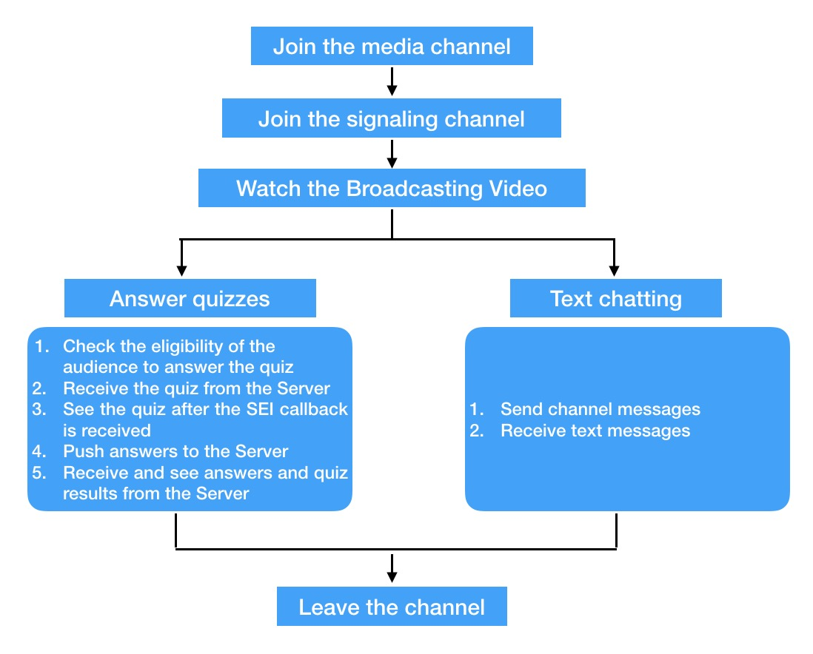
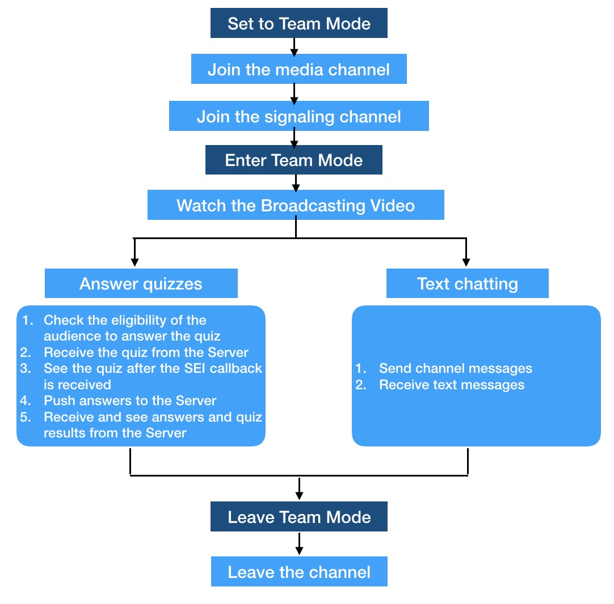
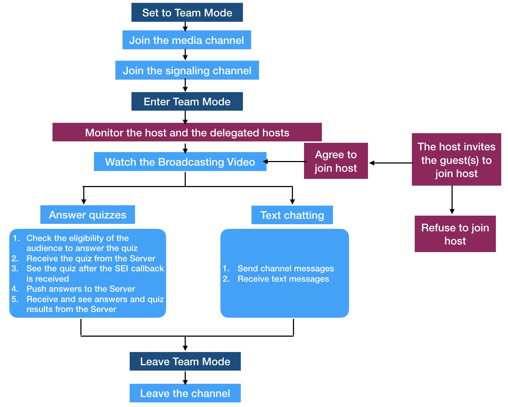

# Agora Game Show Client SDK Integration for iOS (Audience member)

This page explains how to integrate the Agora Live Quiz SDK for iOS (audience member).

There are three types of integration available. Each mode builds upon the previous integration:

- [Live Broadcast Mode Integration](#live-broadcast-mode-integration)
- [Team Mode Integration](#team-mode-integration)
- [Co-host Mode Integration](#co-host-mode-integration)

## Live Broadcast Mode Integration

The following figure explains how to integrate the Agora HQ SDK for Live Broadcast Mode.

### Join the media channel

This method joins a user to the channel specified by `channelName`. For more information, reference the [Join a Channel (joinChannel)](https://docs.agora.io/en/2.3.1/product/Interactive%20Broadcast/API%20Reference/live_video_android#live-android-joinchannel-en) API method.

**Note:** Users who want to join the same game, must use the same App ID and `channelName`.
	
`- (int)joinChannelByToken:(NSString *)token
            channelName:(NSString *)channelId
            info:(NSString *)info
            uid:(NSUInteger)uid
            joinSuccess:(void(^)(NSString* channel, NSUInteger uid, NSInteger elapsed))joinChannelSuccessBlock;`

### Join the signaling channel

Use the `login` method to join the user to the signaling channel

`- (void)login:(NSString *)account token:(NSString *)token channel:(NSString *)channel;`

### View the host's broadcast video

View the host's broadcasted video using the media callback `onFirstRemoteVideoDecoded`. For more information, reference the [First Remote Video Frame Displayed Callback (onFirstRemoteVideoFrame)](https://docs.agora.io/en/2.3.1/product/Interactive%20Broadcast/API%20Reference/live_video_android#onfirstremotevideoframe-android-en).

`- (void)rtcEngine:(AgoraRtcEngineKit *)engine firstRemoteVideoDecodedOfUid:
  (NSUInteger)uid size:(CGSize)size elapsed:(NSInteger)elapsed`

### Answer Questions

1. Ensure the user is eligible to answer questions.
		
	**Note:** Implemented by Agora’s customers, based on custom game requirements. Refer to Agora’s sample templates for an example of how the application checks user eligibility.
		
2. Retrieve the questions from the server using the signaling `onChannelMessageReceived` callback.

	`- (void)agoraHQSig:(AgoraHQSigKit *)agoraHQSig didReceivedChannelMessage:(NSString *)channel message:(NSString *)message messageId:(long long)messageId;`

3. Display the question upon receiving the SEI `onReceiveSEI` callback from the media SDK. For more information, reference the [Callback for Android](https://docs.agora.io/en/2.3.1/product/Interactive%20Broadcast/API%20Reference/live_contest#onreceivesei-android).

	`- (void)rtcEngine:(AgoraRtcEngineKit * _Nonnull)engine didReceiveSEI:(NSString * _Nonnull)sei;`

4. Upload answers to the server.

	**Note:** Implemented by Agora’s customers based on custom game requirements. Refer to Agora’s sample templates for and example of how to upload the selected answers to the server.

5. Retrieve the right answer from the server and display it using the signaling `didReceivedChannelMessage` callback

	`- (void)agoraHQSig:(AgoraHQSigKit *)agoraHQSig didReceivedChannelMessage:(NSString *)channel message:(NSString *)message messageId:(long long)messageId;`

### Text Messaging

1. Send channel messages using the Signaling `sendChannelMessage()` API method

	`- (BOOL)sendChannelMessage:(NSString *)message messageId:(long long)messageId;`

2. Receive messages from the signaling `didReceivedChannelMessage` callback

	`- (void)agoraHQSig:(AgoraHQSigKit *)agoraHQSig didReceivedChannelMessage:(NSString *)channel message:(NSString *)message messageId:(long long)messageId;`

### Leave the channel

Leave the channel using the `leaveChannel()` method. The `leaveChannel()` method releases all resources related to the call. Once the user leaves the channel, the SDK triggers the `onLeaveChannel` callback.

`- (int)leaveChannel:(void(^)(AgoraRtcStats* stat))leaveChannelBlock;`

For more information, reference the [Leave a Channel (leaveChannel)](https://docs.agora.io/en/2.3.1/product/Interactive%20Broadcast/API%20Reference/live_video_android#live-android-leavechannel-en) method.

## Team Mode Integration

The following figure explains how to integrate the Agora HQ SDK for Team Mode.

Team Mode integration is similar to the [Live Broadcast Mode Integration](#live-broadcast-mode-integration), but adds three additional steps (designated by the dark blue blocks).

Create two Agora media engines:

- `mainEngine` to join the live broadcast channel
- `subEngine` to join the team channel

Agora recommends using mainEngine only, to call voice and video-specific functions, because using two engines may cause issues between the voice and video SDK functionalities.

**Note:** The two engines on iOS use the same delegate. If you set both engines as the current controller, you need to specify the engine in the delegate.

Apply the following steps to enable Team Mode:

- [Set Team Mode](#set-team-mode)
- [Enter Team Mode](#enter-team-mode)
- [Leave Team Mode](#leave-team-mode)

Once Team Mode is set, the user can also [set the volume of the host/broadcaster](#set-the-volume-of-the-broadcaster)

### Set Team Mode

Use `mainEngine` to call the following interface prior to joining the channel:

`setParameters("{\"rtc.hq_mode\": {\"hq\": true, \"broadcaster\":false, \"bitrate\":0}}")`

### Enter Team Mode

Use `subEngine` to call the `setParameters` method.

`setParameters("{\"rtc.hq_mode\": {\"hq\": true, \"broadcaster\":true, \"bitrate\":50}}")`

Use the `joinChannel()` method to join a channel and enter Team Mode.

For more information, reference the [Join a Channel (joinChannel)](https://docs.agora.io/en/2.3.1/product/Interactive%20Broadcast/API%20Reference/live_video_android#live-android-joinchannel-en) method.

### Leave Team Mode

Use `subEngine` to call the `setParameters()` method.

`setParameters("{\"rtc.hq_mode\": {\"hq\": true, \"broadcaster\":false, \"bitrate\":0}}")`

Use `mainEngine` to call the `leaveChannel()` method to leave the channel. The `leaveChannel()` method releases all resources related to the call. Once the user leaves the channel, the SDK triggers the `onLeaveChannel` callback.

For more information, reference the [Leave a Channel (leaveChannel)](https://docs.agora.io/en/2.3.1/product/Interactive%20Broadcast/API%20Reference/live_video_android#live-android-leavechannel-en) method.

### Set the Volume of the Broadcaster

**Note:** Currently, Team Mode supports voice functions only.

1. To lower the volume of the host/broadcaster, use the `onAudioVolumeIndication` callback to retrieve the volume of the host.

	`- (void)rtcEngine:(AgoraRtcEngineKit *)engine reportAudioVolumeIndicationOfSpeakers:`

	For more information, reference the [Audio Volume Indication Callback (onAudioVolumeIndication)](https://docs.agora.io/en/2.3.1/product/Interactive%20Broadcast/API%20Reference/live_video_android#onaudiovolumeindication-android).
  
2. Use the `setParameters()` method to lower the volume of the broadcaster.

	`setParameters("{\"che.audio.playout.uid.volume\":{\"uid\":hostUid,\"volume\":30}}")`

	Parameter|Name
---|---
`hostUid`|UID of the host
`speakerNumber`|Number of speakers
`totalvolume`|Total volume. Ranges between 0 and 100.

## Co-host Mode Integration

The following figure explains how to integrate the Agora HQ SDK for Co-host Mode.

Co-host Mode integration is similar to the [Team Mode Integration](#team-mode-integration), but adds four additional steps (designated by the purple blocks).

**Note:** To enable Co-host Mode only, skip the [parameter settings step for Team Mode](#set-team-mode) before joining the channel. See [Advanced: Hosting In](https://docs.agora.io/en/2.3.1/product/Interactive%20Broadcast/Quickstart%20Guide/hostin_android) for integrating the SDK.

To enable Co-host Mode:

1. The host sends the co-host's account to the server
2. The server sends an invitation to the invited audience member

Co-host Mode requires integration into the co-host and client applications.

- [Integrating the Co-host Application](#integrating-the-co-host-application)
- [Integrating the Client Application](#integrating-the-client-application)

### Integrating the Co-host Application

#### Get the Invitation

The co-host can accept or decline an invitation by sending an acceptance or rejection message to the server using the `didReceivedMessageFromAccount` callback.

`- (void)agoraHQSig:(AgoraHQSigKit *)agoraHQSig didReceivedMessageFromAccount:(NSString *)account message:(NSString *)message messageId:(long long)messageId;`

#### Start Co-host Mode

After the acceptance message is sent, the co-host needs to use the `setParameters()` method method to start co-host mode.

`setParameters("{\"rtc.hq_mode\": {\"hq\": true, \"broadcaster\":true, \"bitrate\":1000}}")`

**Note:** In this example, the `bitrate` is set to `1000`. The actual value must be the same as the one set when calling the `setVideoProfile()` API method.

#### Stop Co-host Mode

The co-host can use the `rtcEngine.setParameters()` method to stop co-host mode.

`rtcEngine.setParameters("{\"rtc.hq_mode\": {\"hq\": true, \"broadcaster\":false, \"bitrate\":0}}")`

**Note:** The current Agora HQ SDK does not have callback functions for starting or stopping co-host mode. If you want to be informed when a co-host starts and stops co-host mode, Agora recommends:

- Using `muteLocalVideoStream(false)` when co-host mode starts
- Using `muteLocalVideoStream(true)` when co-host mode stops
- Using the `didVideoMuted` callback function to monitor co-host modes
- You can also synchronize the state with the signaling system.

### Integrating the Client Application

#### Monitor the first published stream of the host and co-host

Use the `firstRemoteVideoDecodedOfUid` callback method to monitor the first published stream of the host and co-host.

`rtcEngine(_ engine: AgoraRtcEngineKit, firstRemoteVideoDecodedOfUid uid: UInt, size: CGSize, elapsed: Int)`

**Note:** The `UID` of this callback function identifies the host

#### Monitor the Co-host

Use the `didVideoMuted` callback method to monitor the co-host.

`rtcEngine(_ engine: AgoraRtcEngineKit, didVideoMuted muted: Bool, byUid uid: UInt)`

## Resources

For more information about the Agora HQ API methods, see [Agora HQ API](https://docs.agora.io/en/2.3.1/product/Interactive%20Broadcast/API%20Reference/live_contest).