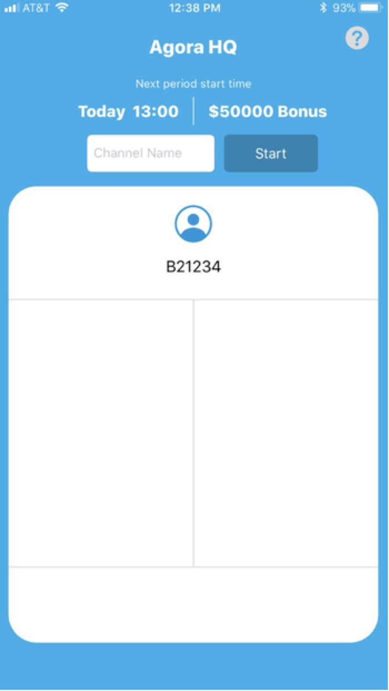
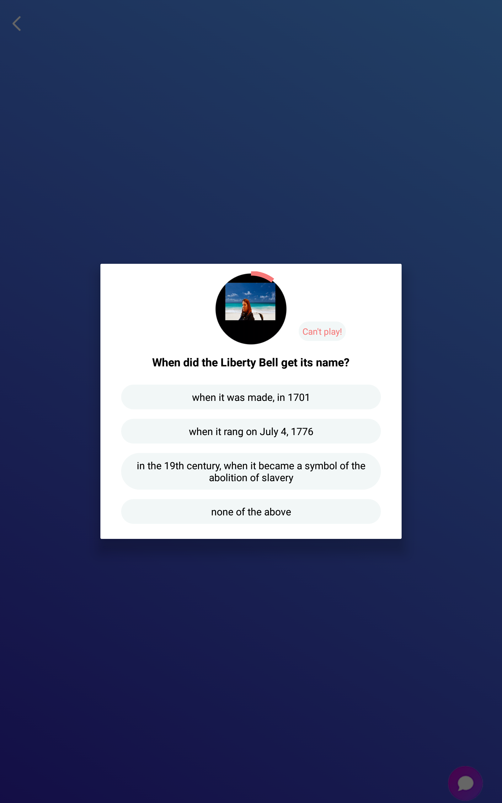
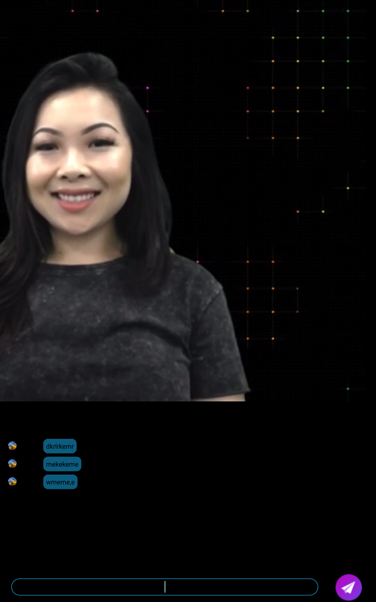
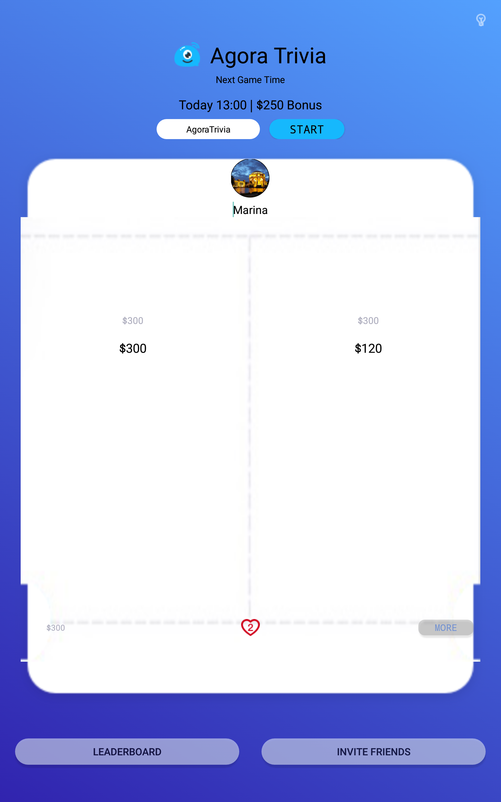

# Game Play Instructions (Audience Member)

Start the application on your iOS or Android device. 

Enter the same **Channel Name** as [the host](#set-the-configuration). Once you have successfully logged in, you will see the broadcaster’s video.

**Note:** If the host has not started the game in the specified channel, a dialog box will appear, notifying the user that the channel is not found.

## Play the Game

When the host clicks **Start Question** in their application, the audience member will see the question on their mobile device.

Click on an answer to the question. Repeat this process until the host stops sending questions.

During the game, users can chat with other audience members.

## Game End

When the game ends, you will see a s creen that shows the prize breakdown. The user can click **START** to play again.

