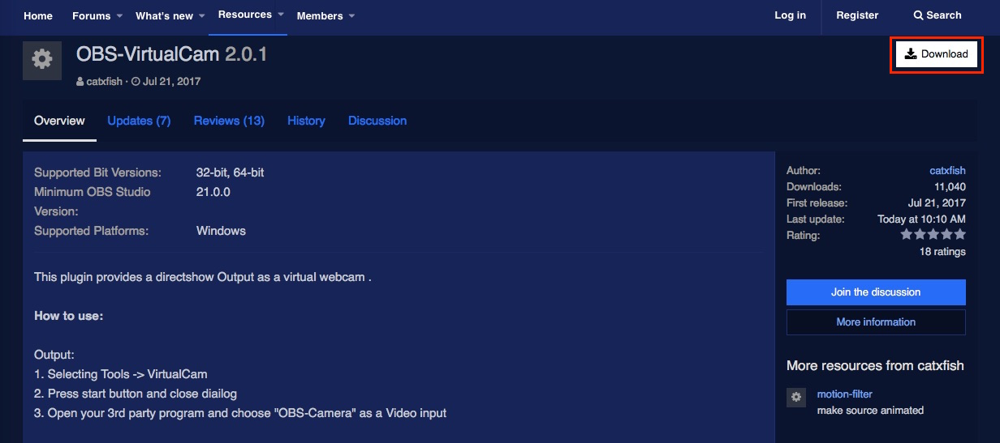

# Install VirtualCam for OBS Studio

Download the VirtualCam plugin for OBS Studio [here](https://obsproject.com/forum/resources/obs-virtualcam.539/).

Click on **Download** button to download the installer EXE file.

Once the file downloads, open the installer and follow the on-screen instructions.

**Note:** To use the plugin, you must open OBS Studio and select **VirtualCam** from the OBS Studio **Tools** menu.