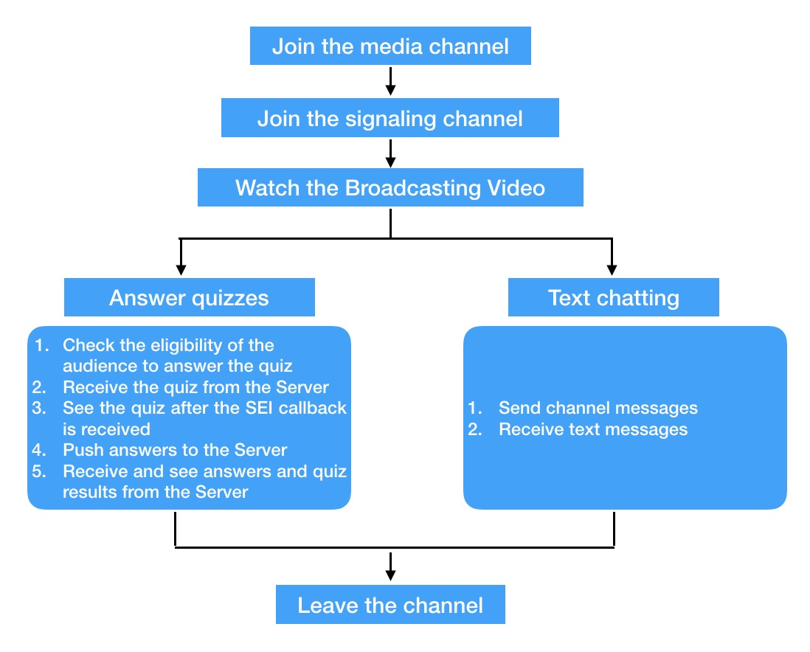

# Agora Game Show Client SDK Integration for iOS (Audience member)

This page explains how to integrate the Agora Live Quiz SDK for iOS (audience member).

# Live Broadcast Mode Integration

The following figure explains how to integrate the Agora HQ SDK for Live Broadcast Mode.

1. Join the media channel

	See Join a Channel (joinChannel)
	
	`- (int)joinChannelByToken:(NSString *)token
            channelName:(NSString *)channelId
            info:(NSString *)info
            uid:(NSUInteger)uid
            joinSuccess:(void(^)(NSString* channel, NSUInteger uid, NSInteger elapsed))joinChannelSuccessBlock;`

2. Join the signaling channel

	`- (void)login:(NSString *)account token:(NSString *)token channel:(NSString *)channel;`

3. View the host

	This is implemented using the media callback. See [First Remote Video Frame Displayed Callback (onFirstRemoteVideoFrame)](https://docs.agora.io/en/2.3.1/product/Interactive%20Broadcast/API%20Reference/live_video_android#onfirstremotevideoframe-android-en).

	`- (void)rtcEngine:(AgoraRtcEngineKit *)engine firstRemoteVideoDecodedOfUid:
  (NSUInteger)uid size:(CGSize)size elapsed:(NSInteger)elapsed`

Step 4: Answer the questions

4. Answer the questions

	1. Check if you are eligible to answer the questions. (To be implemented by Agora’s customers. Refer to Agora’s sample apps to check the eligibility of each user.)
	2. Get the questions sent from the server. This is implemented by using the signaling callback.
	
	`- (void)agoraHQSig:(AgoraHQSigKit *)agoraHQSig didReceivedChannelMessage:(NSString *)channel message:(NSString *)message messageId:(long long)messageId;`

	3. Display the question when receiving the SEI callback from the media SDK. See Callback on the iOS device.

	`- (void)rtcEngine:(AgoraRtcEngineKit * _Nonnull)engine didReceiveSEI:(NSString * _Nonnull)sei;`

Upload the answers to the server. (To be implemented by Agora’s customers. You can also refer to Agora’s sample app for uploading the selected answers to the server.)
Get the right answer from the server and display it. This is implemented using the signaling callback.
- (void)agoraHQSig:(AgoraHQSigKit *)agoraHQSig didReceivedChannelMessage:(NSString *)channel message:(NSString *)message messageId:(long long)messageId;
Step 5: Text messaging

Send channel messages using the Signaling API:
- (BOOL)sendChannelMessage:(NSString *)message messageId:(long long)messageId;
Note
The message ID of each channel message must be unique.
Receive the text messages. This is implemented by the signaling callback:
- (void)agoraHQSig:(AgoraHQSigKit *)agoraHQSig didReceivedChannelMessage:(NSString *)channel message:(NSString *)message messageId:(long long)messageId;
Step 6: Leave the channel

See Leave a Channel (leaveChannel)
- (int)leaveChannel:(void(^)(AgoraRtcStats* stat))leaveChannelBlock;
Integrating in Team Mode

Follow the steps shown in the following figure to integrate the Agora Live Quiz SDK in Team Mode.
../_images/contest_group.jpg
See Integrating in Basic Live Broadcast Mode for the steps in the light-blue blocks.
Note
In Team Mode, you need to create two Agora media engines; mainEngine for joining the live broadcast channel and subEngine for joining the team channel. Agora recommends only using mainEngine to call voice- and video-specific functions because using two engines may affect the voice and video functionalities of the SDK.
The two engines on iOS use the same delegate. If you set both engines as the current controller, you need to specify the engine in the delegate.
Set to Team Mode

To implement Team Mode, use mainEngine to call the following interface before joining the channel.
setParameters("{\"rtc.hq_mode\": {\"hq\": true, \"broadcaster\":false, \"bitrate\":0}}")
Enter Team Mode

Use subEngine to call the following method, and then use Join a Channel (joinChannelByToken) to enter Team Mode.
setParameters("{\"rtc.hq_mode\": {\"hq\": true, \"broadcaster\":true, \"bitrate\":50}}")
Leave Team Mode

Use subEngine to call the following method, and then use Leave a Channel (leaveChannel) to leave Team Mode.
setParameters("{\"rtc.hq_mode\": {\"hq\": true, \"broadcaster\":false, \"bitrate\":0}}")
Leave the channel

Use mainEngine to call Leave a Channel (leaveChannel).
Set the volume of the broadcaster in Team Mode

If your team member is talking and you wish to lower the volume of the broadcaster, use Audio Volume Indication Callback (reportAudioVolumeIndicationOfSpeakers) to get the volume of the host:
 - (void)rtcEngine:(AgoraRtcEngineKit *)engine reportAudioVolumeIndicationOfSpeakers:
(NSArray*)speakers totalVolume:(NSInteger)totalVolume
Use this method to lower the volume of the broadcaster:
setParameters("{\"che.audio.playout.uid.volume\":{\"uid\":hostUid,\"volume\":30}}")
Parameter	Name
hostUid	UID of the host.
volume	Volume ranging between 0 and 100.
Note
Currently, Team Mode supports voice functions only.
Integrating in Co-host Mode

Follow the steps shown in the following figure to integrate the Agora HQ SDK in Co-host Mode.
../_images/contest_celebrity.jpg
See Integrating in Basic Live Broadcast Mode and Integrating in Team Mode for the steps in the light-blue and dark-blue blocks respectively.
This part mainly includes methods for Get the invitation, Start the co-host Mode, Stop the co-host Mode, Monitor the first publishing stream of the host and co-host, and Monitor the co-host on the part of the client.
To enable Co-host Mode, the host needs to send the account of the co-host to the server, and then the server sends an invitation to the invited audience.
Note
If you wish to enable Co-host Mode only, skip the parameter settings step for Team Mode before joining the channel. See Advanced: Hosting In for integrating the SDK.
The Co-host

Get the invitation

The co-host can accept or decline an invitation by sending an acceptance or rejection message to the server.
- (void)agoraHQSig:(AgoraHQSigKit *)agoraHQSig didReceivedMessageFromAccount:(NSString *)account message:(NSString *)message messageId:(long long)messageId;
Start the Co-host Mode

After the acceptance message is sent, the co-host needs to use this following method to start the co-host mode.
setParameters("{\"rtc.hq_mode\": {\"hq\": true, \"broadcaster\":true, \"bitrate\":1000}}")
Note
Here the bitrate is set to 1000 just for example, and the actual value must be the same as the one you set when calling the API setVideoProfile .
Stop the Co-host Mode

The co-host can use this method to stop the co-host mode.
rtcEngine.setParameters("{\"rtc.hq_mode\": {\"hq\": true, \"broadcaster\":false, \"bitrate\":0}}")
Note
The current Agora Live Quiz SDK does not have any callback functions for starting or stopping the co-host mode. If you want to be informed when a co-host starts and stops the co-host mode, Agora recommends using muteLocalVideoStream(false) when the co-host mode starts and muteLocalVideoStream(true) when the co-host mode stops. Use the didVideoMuted callback function to monitor the co-host modes. You can also synchronize the state with the signaling system.
The Client

Monitor the First Publishing Stream of the Host and Co-host

rtcEngine(_ engine: AgoraRtcEngineKit, firstRemoteVideoDecodedOfUid uid: UInt, size: CGSize, elapsed: Int)
Note
You can identify who is hosting from the UID of this callback function.
Monitor the Co-host

rtcEngine(_ engine: AgoraRtcEngineKit, didVideoMuted muted: Bool, byUid uid: UInt)
For more information on the Agora HQ API methods, see Agora HQ API.