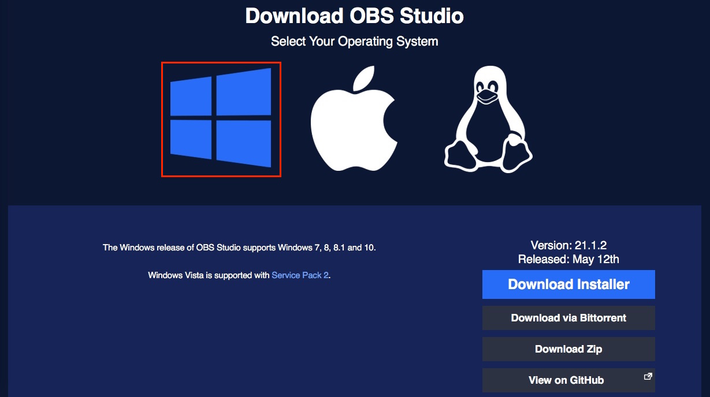
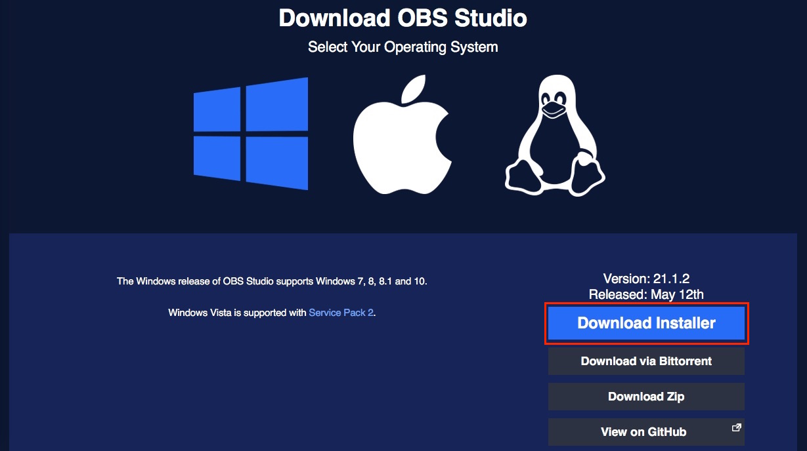

# Install OBS Studio

Download OBS Studio [here](https://obsproject.com/download).

Ensure the Windows icon is selected.

Click on **Download Installer** to download the installer EXE file.

Once the file downloads, open the installer and follow the on-screen instructions.