# Game Play Instructions - Host

## Start the Game as a Host

The host has the ability to start / end the game, and set game configuration parameters.

- [Start the Application](#start-the-application)
- [Enable OBS](#enable-obs)
- [Set the Configuration](#set-the-configuration)
- [Start the Game](#start-the-game)
- [Play the Game](#play-the-game)

### Start the Application

Run the AgoraHQ.exe file. Ensure the green bars are lit in the upper left corner. The green bars indicate a successful network connection.

**Note:** If the upper left corner is red instead of green, check your network connection before proceeding or the application will not run properly.

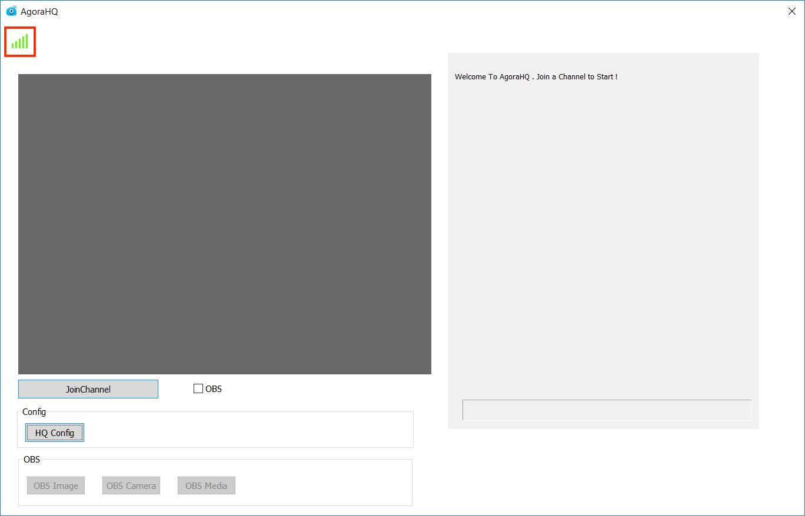

### Enable OBS

Enabling OBS is optional. This gives users the ability to: 

- Click the OBS image button to load a local picture
- Click the OBS camera button to launch the camera device
- Click the OBS media button to load a local media file
	
**Note:** OBS objects can be loaded one after another. OBS objects can:

- Move positions
- Change front/back relationships by right clicking the objects and selecting move up, move down, etc. 
- Apply a red, blue, or green filter using the select filter dropdown menu

Enabling OBS, requires settings in the demo application and OBS Studio:

- [Open the VirtualCam plugin](#open-the-virtualcam-plugin)
- [Enable OBS in the Demo Application](#enable-obs-in-the-demo-application)
- [Add VirtualCam Filter](#add-virtualcam-filter)

#### Open the VirtualCam plugin

If you don't have OBS Studio or the VirtualCam plugin, download the [software](https://obsproject.com/download) and the [plugin](https://obsproject.com/forum/resources/obs-virtualcam.539/)

In OBS Studio, open the VirtualCam plugin by selecting **Tools** -> **VirtualCam**.

Press the **Start** button and close dialog box.

#### Enable OBS in the Demo Application
	
1. Check **OBS** checkbox 

	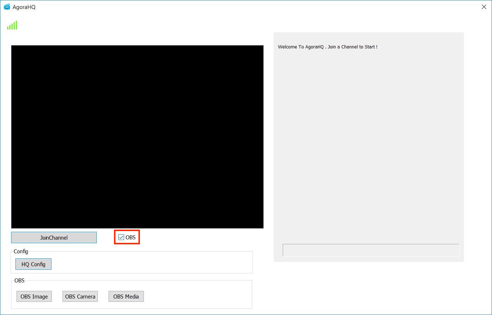 

2. Click on **OBS Camera**. This will open the properties window.

	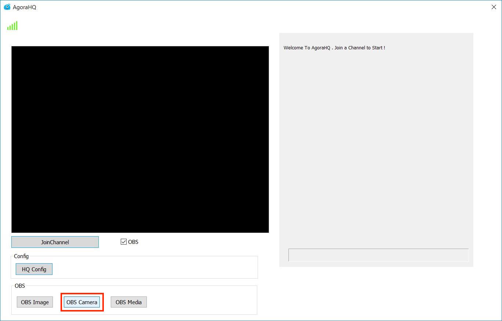

3. Choose a device from the **Camera Device** dropdown menu and press **OK**.

	**Note:** The available camera device options will vary, based on your system and hardware connections.

	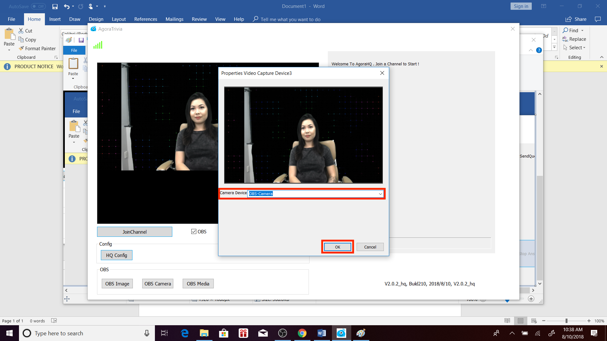

#### Add VirtualCam Filter

1. Add a filter to the source you want to output to the camera

2. Choose a sync camera target and press the **Start** button

3. If this camera is not yet active, the **Start** button will switch to a **Stop** button

For more information about using OBS Studio, reference the official [OBS Video Guide](https://obsproject.com/forum/resources/full-video-guide-for-obs-studio-and-twitch.377/) or reference the [Agora Github Wiki](https://github.com/AgoraIO/HQ/wiki).

### Set the Configuration

1. Click on **HQ Config** to open the configuration window.

2. In the configuration window, set the configuration for your application:
	
	- Enter the Agora App ID into the **APPID** UI text field.

	- Select the appropriate region from the **Region** dropdown menu:
		- If the application will be used outside of mainland China select the **Overseas Edition** option.
		- If the application will be used in mainland China, select the **Chinese Edition** option.

		**Note:** After changing the region setting, the signal bar in the upper left corner of the app should turn green, indicating a successful connection. 
		
	- Enter a channel name in the **ChannelName** UI text field. Ensure the channel name is the same as your audience members.

		**Note:** If running the demo application, do not change the channel name.

	- Select a camera from the **CAMERA** dropdown menu. If OBS is enabled, select **OBS-Camera**.

	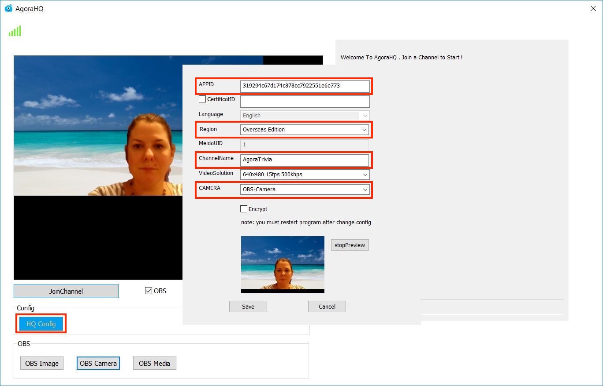

	**Note:** For security reasons, the production environment must enable a Dynamic key or Access Token (a new version of the Dynamic Key). Learn more about enabling it [here](https://docs.agora.io/en/2.3.1/product/Interactive%20Broadcast/Agora%20Platform/key_native?platform=Android).

3. Click **OK** to reboot the application. The application will restart, applying the updated configuration settings.

	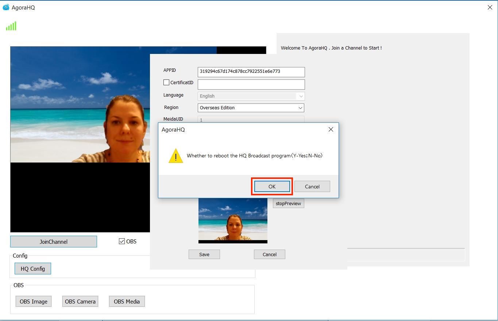

### Start the Game

The following figure explains the game flow for the host, and how to hand out questions:

The last **Send Question** indicates the host will need to repeat the **Send Question** -> **Start Question** -> **Stop Answer** process again, until all questions are sent to the audience members. The game ends when all questions have been sent and answered.

### Join the Channel

Click **JoinChannel** to start the game. 

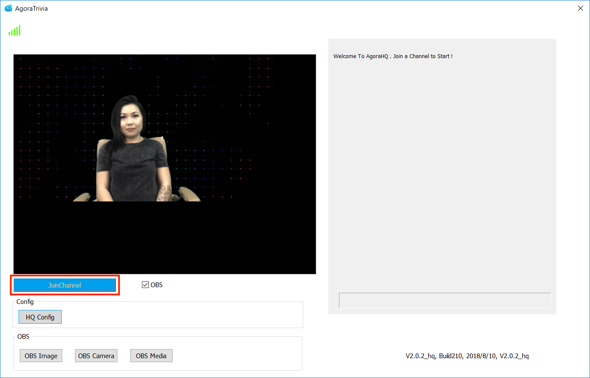

This starts the game, and the you will see your local camera view on the device.

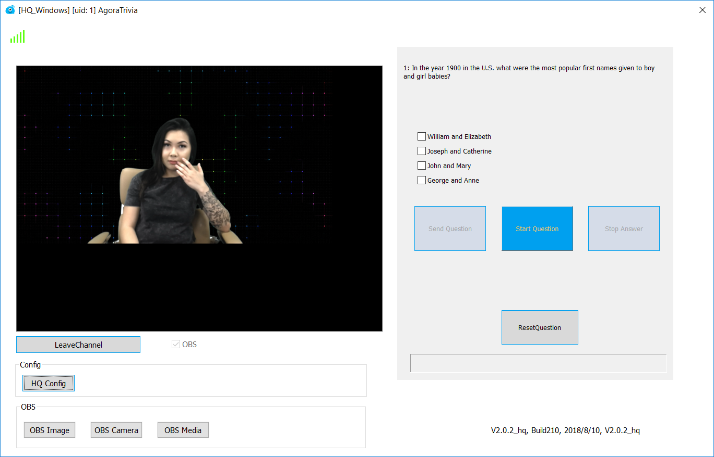

### Game Play Buttons

Command|Description
---|---
Send Question|Sends a question (and a set of multiple choice answers)
Start Question|Synchronizes the question with the video, allowing participants to see question on their mobile devices
Stop Answer|Stop audience members for answering the question. If this is pressed on the last question, the game ends. The host will receive the results of the game participants.<ul><li>Question：the sequence number of the current question</li><li>Total: the total number of the participants</li><li>Correct: the number of participants who answered correctly</li><li>Wrong: the number of participants who answered incorrectly</li><li>Answer: the number of correct answers</li><li>A/B/C/D: the number of participants selecting each answer option</li><li>rightPercent: the percentage of correct answers</li></ul>
Reset Question|Resets the game to the beginning. It restarts the answering process without changing the quiz set.

### Play the Game

1. Press **Send Question** to send the questions to audience members
2. Press **Start Question** to display the question to audience members

**Note:** To ensure synchronization between the questions and the video, click **Start Question** after **Send Question** so all users in the channel will be able to see the questions at the simultaneously.

**Note:** The **Start Question**, and **Stop Answer** buttons are highlighted in blue to indicate the button can be pressed. Buttons are greyed out to indicate the button can not be pressed. Pressed buttons turn grey to prevent selection errors

Press **Stop Answer** to stop audience members from answering the question.

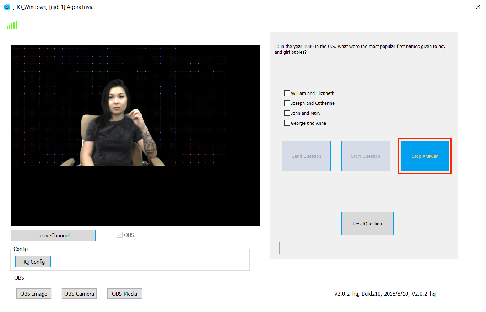

Press **Reset Question** at any time, to restart the game.

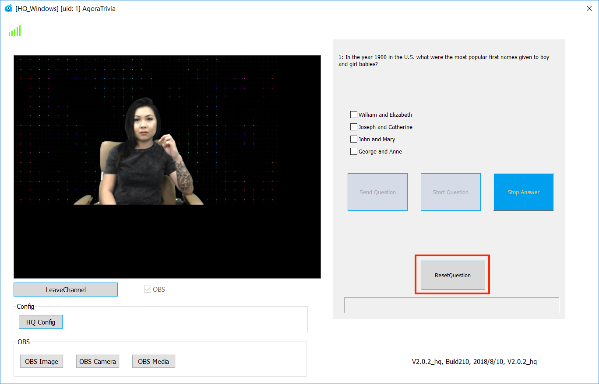

### End of Game

At the end of the game, the results will display.

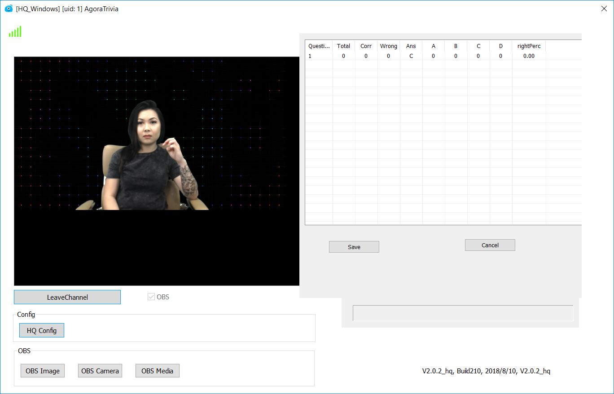
